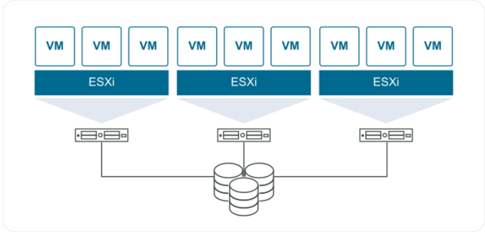
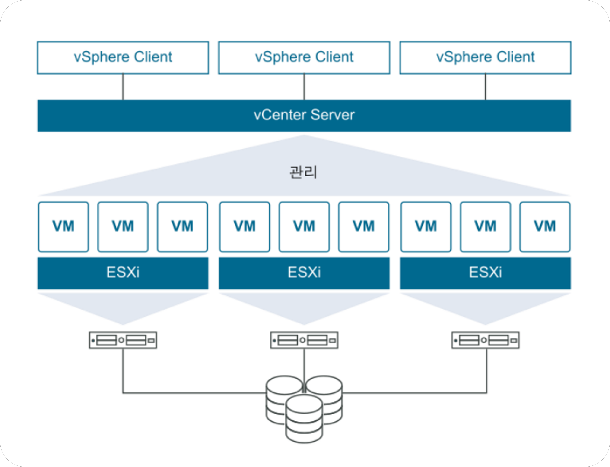

# VMware Virtualization

 

VMware는 전 세계적으로 널리 사용되는 가상화 기술 기업이다.   <strong> 물리적인 서버 한 대를 여러 개의 가상 머신(VM)</strong>으로 분리해 운영할 수 있도록 만들어주는 소프트웨어를 제공한다.   VMware는 데이터센터와 클라우드 인프라 전반을 가상화하는 데 초점을 맞춘다.

 

## VMware의 주요 구성 요소

### 1️⃣ ESXi

\- VMware의 핵심 제품이자 하이퍼바이저(Hypervisor)   \- 하이퍼바이저란 물리적인 하드웨어 자원을 VM들이 나누어 쓸 수 있도록 중간에서 **자원을 분배·관리**하는 소프트웨어 계층   \- 즉, 하나의 물리 서버를 여러 개의 독립된 서버처럼 동작하게 만드는 역할을 수행함

\- ESXi는 **Elastic Sky X Integrated**의 약자로, VMware에서 개발한 베어메탈 타입의 하이퍼바이저   \- OS 위에서 동작하는 것이 아니라 **물리 서버에 직접 설치**됨   \- ex) 하나의 서버 위에 Ubuntu, Windows Server, CentOS VM을 동시에 실행할 수 있음

 

### 2️⃣ vCenter Server

\- 여러 ESXi 호스트를 한 번에 관리할 수 있는 **중앙 관리 도구**   \- VM 생성, 백업, 스냅샷, 스토리지 연결, 네트워크 설정 등을 통합 관리   \- 대규모 환경에서는 vMotion, DRS, HA(고가용성) 기능 등을 지원함
> [!TIP]
> **vSphere == ESXi + vCenter Server**   즉, VMware의 가상화 플랫폼 전체를 지칭함

