# VMware Virtualization

VMware는 전 세계적으로 널리 사용되는 가상화 기술 기업이다.   <strong> 물리적인 서버 한 대를 여러 개의 가상 머신(VM)</strong>으로 분리해 운영할 수 있도록 만들어주는 소프트웨어를 제공한다.   VMware는 데이터센터와 클라우드 인프라 전반을 가상화하는 데 초점을 맞춘다.

 

### < 가상화의 주요 기능 >

<table>
  <tr><td>Sharing</td><td>여러 VM이 물리 자원을 공유하여 효율적으로 사용함</td></tr>
  <tr><td>Aggregation</td><td>여러 자원을 하나처럼 묶어 통합적으로 관리함</td></tr>
  <tr><td>Emulation</td><td>존재하지 않는 자원을 소프트웨어적으로 흉내내어 제공함</td></tr>
  <tr><td>Insulation</td><td>VM 간 영향을 차단하여 독립성을 보장함</td></tr>
</table>

 

### - 목차 -

000
000

 

# ◈ VMware의 주요 구성 요소

## 1️⃣ ESXi

\- VMware의 핵심 제품이자 하이퍼바이저(Hypervisor)   \- 물리적인 하드웨어 자원을 VM들이 나누어 쓸 수 있도록 중간에서 **자원을 분배·관리**하는 소프트웨어 계층   \- 즉, 하나의 물리 서버를 여러 개의 독립된 서버처럼 동작하게 만드는 역할을 수행함

\- ESXi는 **Elastic Sky X Integrated**의 약자로, VMware에서 개발한 베어메탈 타입의 하이퍼바이저   \- OS 위에서 동작하는 것이 아니라 **물리 서버에 직접 설치**됨   \- ex) 하나의 서버 위에 Ubuntu, Windows Server, CentOS VM을 동시에 실행할 수 있음

> [!IMPORTANT]
> 실질적으로 하이퍼바이저는 VM 간 통신을 위한 **LAN (Virtual Switch)을 생성**한다.   물리 네트워크 카드(**NIC**)의 드라이버를 직접 제어하며, 각 VM이 네트워크를 사용할 수 있게 한다.

## 2️⃣ vCenter Server

\- 여러 ESXi 호스트를 한 번에 관리할 수 있는 **중앙 집중형 관리 도구**   \- VM 생성, 백업, 스냅샷, 스토리지 연결, 네트워크 설정 등을 통합 관리함   \- 대규모 환경에서는 vMotion, DRS, HA(고가용성) 기능 등을 지원함
> [!TIP]
> **vSphere == ESXi + vCenter Server** &thinsp;(즉, VMware의 가상화 플랫폼 전체)

## 3️⃣ VMware Workstation

\- 개인 사용자 및 개발자를 위한 데스크톱 가상화 솔루션   \- 실제 기업용 ESXi 환경과 달리, 로컬PC에서 **가상 환경을 시뮬레이션**하는 용도로 사용됨   \- VMware Workstation은 물리적 컴퓨터를 소프트웨어적으로 구현한 형태임

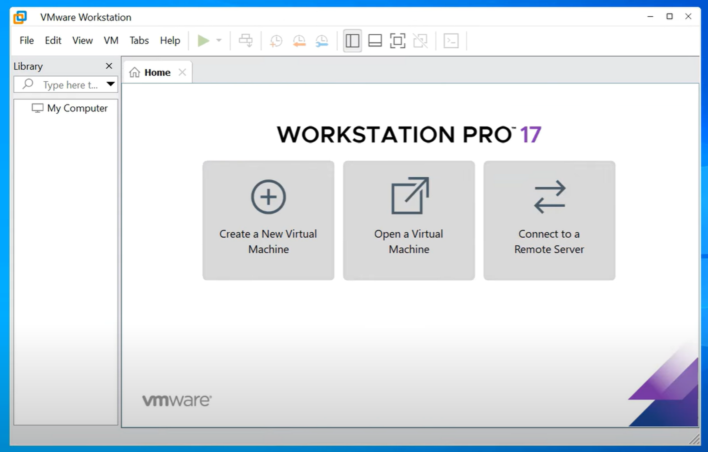

 

# ◈ VMware 네트워크 구성

네트워크 설정은 가상화 환경에서 가장 중요한 핵심 요소 중 하나다.   VMware는 **Virtual Network**를 내부적으로 구성함으로써 각 VM이 외부와 통신할 수 있게 한다.   이 네트워크는 실제 물리적 LAN을 흉내내며, 하나의 물리적 NIC를 여러 VM이 공유하도록 만들어준다.  

< 가상 네트워크의 세 가지 모드 >

<table>
  <tr>
    <td><b>Bridged</b></td>
    <td>VM이 실제 네트워크(LAN)에 연결되어, 호스트와 동일한 네트워크 대역의 IP를 가짐</td>
  </tr>
  <tr>
    <td><b>NAT</b></td>
    <td>VM이 호스트IP를 통해 외부 네트워크와 통신함, 내부적으로는 별도의 가상 IP를 가짐</td>
  </tr>
  <tr>
    <td><b>Host-Only</b></td>
    <td>외부 네트워크와 완전히 분리된 독립적인 가상 네트워크 환경을 구성함</td>
  </tr>
</table>

 

#### ● VMware 네트워크 어댑터 목록 

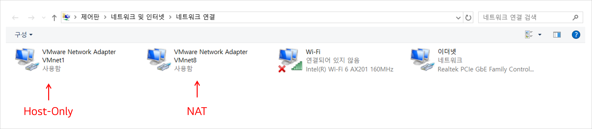

#### ● ipconfig 결과

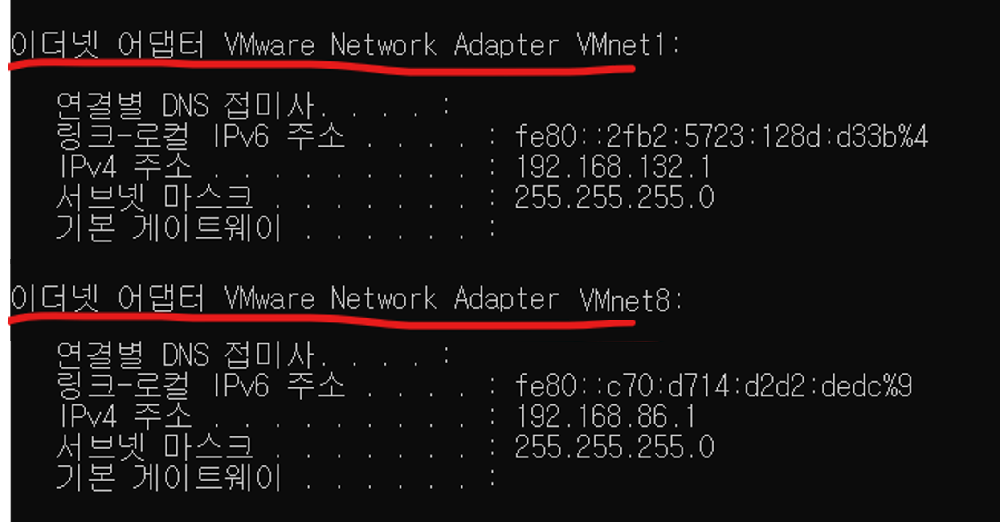

 

## 0️⃣ Virtual Network Editor 설정

\- Virtual Network Editor는 VMware Workstation 메뉴에서 제공되는 도구임   \- 각 VMnet의 네트워크 모드를 직접 지정할 수 있음   \- Wi-Fi 또는 유선랜을 Bridge 대상으로 지정할 수 있으며, NAT나 Host-Only로도 변경 가능함

 

#### ● Bridged 네트워크를 Wi-Fi 어댑터에 연결한 화면

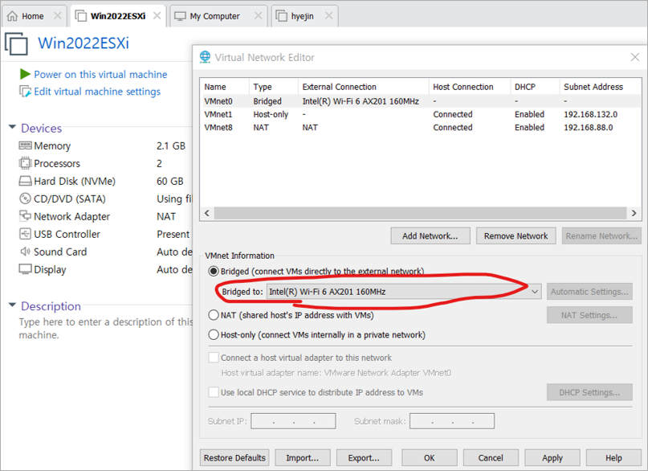

#### ●  VMnet8의 NAT 구성 화면

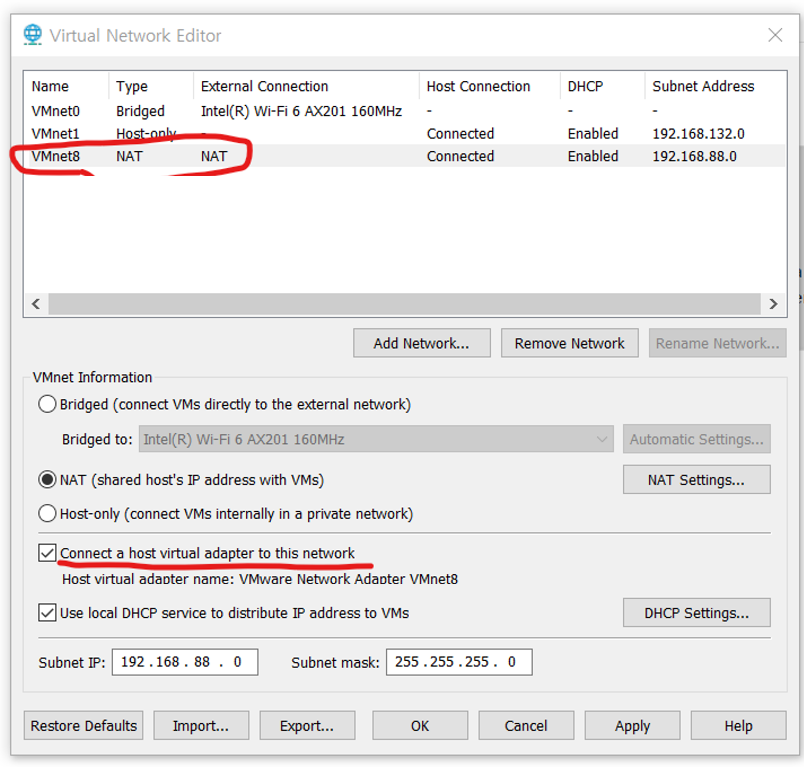

#### ● NAT 네트워크에서 DHCP 서비스 활성화 설정

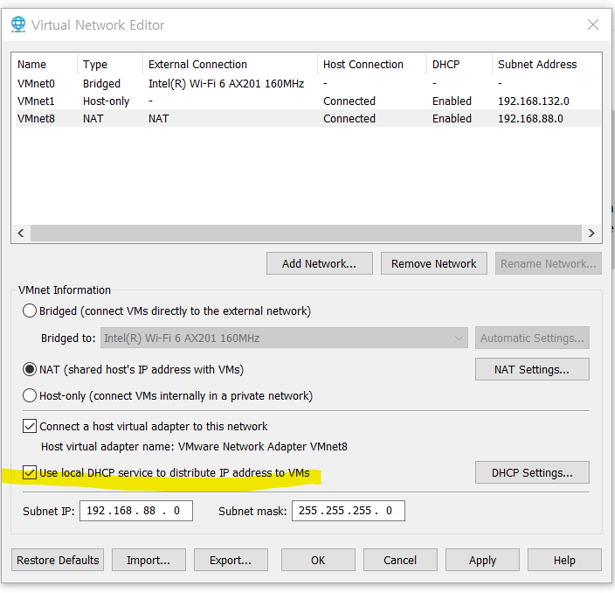

 

# ◈ DNS 서버 설정

vCenter 설치를 위해서는 **FQDN**(Fully Qualified Domain Name)으로 **ESXi 호스트와 vCenter를 식별**해야 한다.   이때 이름과 IP를 서로 **매핑**해주는 역할을 담당하는 것이 DNS 서버이다.   여기서 이름이란 서버의 FQDN과 같은 도메인 기반 호스트 이름을 의미하며,   DNS는 이러한 이름을 **실제 IP 주소로 변환**하거나 반대로 IP를 이름으로 해석한다.

 

## 1️⃣ Windows Server 대시보드에서 DNS 역할 추가

\- Server Manager에서 역할 및 기능 추가(Add Roles and Features) 클릭   \- DNS Server 역할 선택 후 설치 완료   \- 설치가 끝나면 서버 관리자 대시보드에 “DNS” 메뉴가 생김

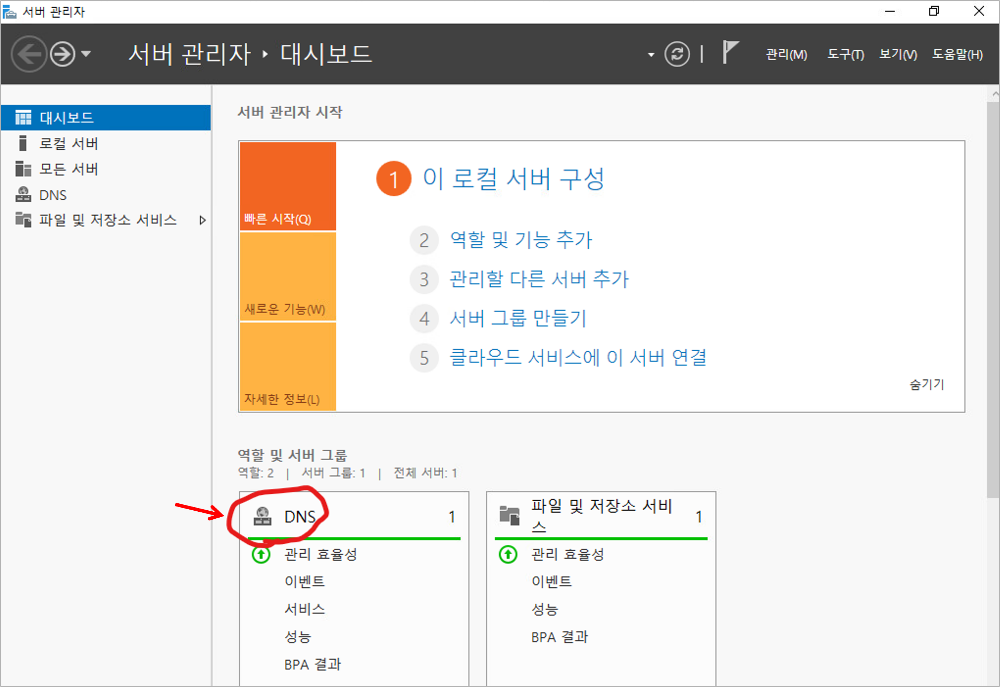

## 2️⃣ DNS 서버 이름과 IPv4 주소 확인

\- 서버 이름(FQDN)과 IPv4 주소를 기록해두면 이후 vCenter 설정 시 참조할 수 있음   \- 서버 상태가 온라인(Online)으로 표시돼야 정상 동작 중임을 의미함

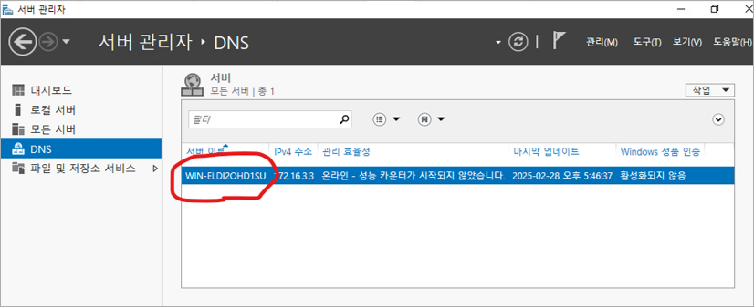

## 3️⃣ DNS 관리 콘솔(DNS Manager) 진입

\- DNS 탭에서 해당 서버를 우클릭해 “DNS 관리자” 선택   \- DNS Manager를 통해 정방향/역방향 조회 영역을 직접 구성할 수 있음

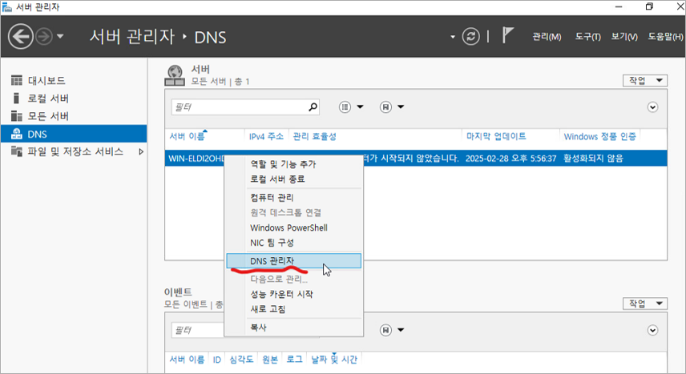

## 4️⃣ 정방향 조회 영역 생성 및 호스트 등록

\- DNS Manager에서 정방향 조회 영역을 선택함   \- 새 영역을 만들어 **도메인 이름을 지정**함   \- 해당 영역 내부에서 “**새 호스트**(A 또는 AAAA)”를 추가해 FQDN과 IP 주소를 매핑함

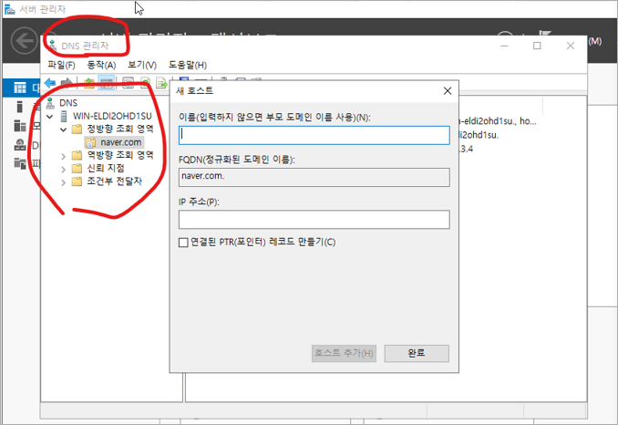

> [!TIP]
> 정방향 조회(Forward Lookup)는 DNS 서버의 가장 기본적인 기능으로,   사람이 이해하기 쉬운 도메인 이름을 IP 주소로 변환하는 역할을 한다.    반대로 역방향 조회(Reverse Lookup) 는 IP 주소를 도메인 이름으로 변환하는 기능으로,   주로 네트워크 분석이나 보안 로그 확인 시 사용된다.    따라서 vCenter 설치 전에 DNS 서버에서
**정방향 조회 영역을 반드시 생성**해야 하며,   ESXi 호스트와 vCenter의 이름(FQDN)과 IP가 올바르게 매핑되어 있어야 한다.

 

# ◈ 스토리지 가상화

서버 가상화가 여러 VM을 하나의 물리 서버 위에서 운영하는 것이라면,   스토리지 가상화(Storage Virtualization)는 여러 스토리지를 하나로 묶어 **논리적으로 통합·관리**한다.   이는 VMware 환경에서 DataStore, iSCSI, NFS, vSAN 등의 형태로 구현된다. 

스토리지 가상화는 단순히 저장 공간을 늘리는 것이 아니라   자원 할당, 백업, 마이그레이션(vMotion) 등 **가상 인프라의 안정성과 확장성을 확보**하는 데 초점을 둔다.

< 주요 스토리지 가상화 구성요소 특징 >

<table>
  <tr>
    <td><b>DataStore</b></td>
    <td>VMware가 인식할 수 있는 논리적 스토리지 단위로, VM 파일(VMDK, ISO 등)을 저장하는 공간임</td>
  </tr>
  <tr>
    <td><b>iSCSI</b></td>
    <td>네트워크를 통해 스토리지 장치를 블록 단위로 연결하는 방식으로, SAN 대체 기술로 활용됨</td>
  </tr>
  <tr>
    <td><b>NFS</b></td>
    <td>파일 단위로 스토리지를 공유하는 방식으로, 설정이 간단하고 여러 호스트 간 파일 접근이 쉬움</td>
  </tr>
  <tr>
    <td><b>vSAN</b></td>
    <td>여러 ESXi 호스트의 로컬 디스크를 묶어 하나의 공유 스토리지처럼 사용하는 SDS 기술임</td>
  </tr>
</table>

 

## 0️⃣ iSCSI 연결 설정

\- iSCSI는 Internet Small Computer System Interface의 약자로   \- **TCP/IP 네트워크**를 통해 스토리지 장치를 서버에 연결하는 기술임   \- 즉, Fibre Channel 없이 LAN 환경에서도 SAN 구성이 가능함

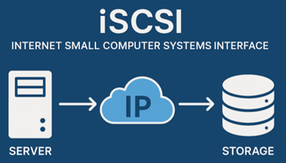

## 1️⃣ 호스트 설정 진입