# VMware Virtualization


VMware는 전 세계적으로 널리 사용되는 가상화 기술 기업이다. <br> <strong> 물리적인 서버 한 대를 여러 개의 가상 머신(VM)</strong>으로 분리해 운영할 수 있도록 만들어주는 소프트웨어를 제공한다. <br> VMware는 데이터센터와 클라우드 인프라 전반을 가상화하는 데 초점을 맞춘다.

<br>

### < 가상화의 주요 기능 >

<table>
  <tr><td>Sharing</td><td>여러 VM이 물리 자원을 공유하여 효율적으로 사용함</td></tr>
  <tr><td>Aggregation</td><td>여러 자원을 하나처럼 묶어 통합적으로 관리함</td></tr>
  <tr><td>Emulation</td><td>존재하지 않는 자원을 소프트웨어적으로 흉내내어 제공함</td></tr>
  <tr><td>Insulation</td><td>VM 간 영향을 차단하여 독립성을 보장함</td></tr>
</table>

<br>

### - 목차 -

[1. VMware의 주요 구성 요소](#-vmware의-주요-구성-요소)

[2. VMware 네트워크 구성](#-vmware-네트워크-구성)

[3. DNS 서버 설정](#-dns-서버-설정)

[4. 스토리지 가상화](#-스토리지-가상화)

[5. DataStore 생성](#-datastore-생성)

[6. vMotion 구성](#-vmotion-구성)

<br>

# ◈ VMware의 주요 구성 요소

VMware 가상화 환경은 단일 소프트웨어로 동작하는 것이 아니라, <br> 서버 가상화, 중앙 관리, 개인용 가상화 등 여러 구성요소가 유기적으로 결합되어 동작한다. 

이러한 구성 요소들은 각각의 계층과 역할이 다르기 때문에, <br> 전체 구조를 이해하기 위해서는 각 요소의 기능과 동작방식을 개별적으로 살펴볼 필요가 있다.

<br>

## 1️⃣ ESXi

\- VMware의 핵심 제품이자 하이퍼바이저(Hypervisor) <br> \- 물리적인 하드웨어 자원을 VM들이 나누어 쓸 수 있도록 중간에서 **자원을 분배·관리**하는 소프트웨어 계층 <br> \- 즉, 하나의 물리 서버를 여러 개의 독립된 서버처럼 동작하게 만드는 역할을 수행함

\- ESXi는 **Elastic Sky X Integrated**의 약자로, VMware에서 개발한 베어메탈 타입의 하이퍼바이저 <br> \- OS 위에서 동작하는 것이 아니라 **물리 서버에 직접 설치**됨 <br> \- ex) 하나의 서버 위에 Ubuntu, Windows Server, CentOS VM을 동시에 실행할 수 있음

> [!IMPORTANT]
> 실질적으로 하이퍼바이저는 VM 간 통신을 위한 **LAN (Virtual Switch)을 생성**한다. <br> 물리 네트워크 카드(**NIC**)의 드라이버를 직접 제어하며, 각 VM이 네트워크를 사용할 수 있게 한다.


<br>

## 2️⃣ vCenter Server

\- 여러 ESXi 호스트를 한 번에 관리할 수 있는 **중앙 집중형 관리 도구** <br> \- VM 생성, 백업, 스냅샷, 스토리지 연결, 네트워크 설정 등을 통합 관리함 <br> \- 대규모 환경에서는 vMotion, DRS, HA(고가용성) 기능 등을 지원함
> [!TIP]
> **vSphere == ESXi + vCenter Server** &thinsp;(즉, VMware의 가상화 플랫폼 전체)


<br>

## 3️⃣ VMware Workstation

\- 개인 사용자 및 개발자를 위한 데스크톱 가상화 솔루션 <br> \- 실제 기업용 ESXi 환경과 달리, 로컬PC에서 **가상 환경을 시뮬레이션**하는 용도로 사용됨 <br> \- VMware Workstation은 물리적 컴퓨터를 소프트웨어적으로 구현한 형태임


<br>

---

<br>

# ◈ VMware 네트워크 구성

네트워크 설정은 가상화 환경에서 가장 중요한 핵심 요소 중 하나다. <br> VMware는 **Virtual Network**를 내부적으로 구성함으로써 각 VM이 외부와 통신할 수 있게 한다. <br> 이 네트워크는 실제 물리적 LAN을 흉내내며, 하나의 물리적 NIC를 여러 VM이 공유하도록 만들어준다.  

<br>

### < 가상 네트워크의 세 가지 모드 >

<table>
  <tr>
    <td><b>Bridged</b></td>
    <td>VM이 실제 네트워크(LAN)에 연결되어, 호스트와 동일한 네트워크 대역의 IP를 가짐</td>
  </tr>
  <tr>
    <td><b>NAT</b></td>
    <td>VM이 호스트IP를 통해 외부 네트워크와 통신함, 내부적으로는 별도의 가상 IP를 가짐</td>
  </tr>
  <tr>
    <td><b>Host-Only</b></td>
    <td>외부 네트워크와 완전히 분리된 독립적인 가상 네트워크 환경을 구성함</td>
  </tr>
</table>

<br>

#### <span style="color:#3498db">●</span> VMware 네트워크 어댑터 목록 


#### <span style="color:#3498db">●</span> ipconfig 결과


<br>

## 0️⃣ Virtual Network Editor 설정

\- Virtual Network Editor는 VMware Workstation 메뉴에서 제공되는 도구임 <br> \- 각 VMnet의 네트워크 모드를 직접 지정할 수 있음 <br> \- Wi-Fi 또는 유선랜을 Bridge 대상으로 지정할 수 있으며, NAT나 Host-Only로도 변경 가능함

<br>

#### <span style="color:#3498db">●</span> Bridged 네트워크를 Wi-Fi 어댑터에 연결한 화면


#### <span style="color:#3498db">●</span>  VMnet8의 NAT 구성 화면


#### <span style="color:#3498db">●</span> NAT 네트워크에서 DHCP 서비스 활성화 설정


<br>

---

<br>

# ◈ DNS 서버 설정

vCenter 설치를 위해서는 **FQDN**(Fully Qualified Domain Name)으로 **ESXi 호스트와 vCenter를 식별**해야 한다. <br> 이때 이름과 IP를 서로 **매핑**해주는 역할을 담당하는 것이 DNS 서버이다. <br> 여기서 이름이란 서버의 FQDN과 같은 도메인 기반 호스트 이름을 의미하며, <br> DNS는 이러한 이름을 **실제 IP 주소로 변환**하거나 반대로 IP를 이름으로 해석한다.

<br>

## 1️⃣ Windows Server 대시보드에서 DNS 역할 추가

\- Server Manager에서 역할 및 기능 추가(Add Roles and Features) 클릭 <br> \- DNS Server 역할 선택 후 설치 완료 <br> \- 설치가 끝나면 서버 관리자 대시보드에 “DNS” 메뉴가 생김


<br>

## 2️⃣ DNS 서버 이름과 IPv4 주소 확인

\- 서버 이름(FQDN)과 IPv4 주소를 기록해두면 이후 vCenter 설정 시 참조할 수 있음 <br> \- 서버 상태가 온라인(Online)으로 표시돼야 정상 동작 중임을 의미함


<br>

## 3️⃣ DNS 관리 콘솔(DNS Manager) 진입

\- DNS 탭에서 해당 서버를 우클릭해 “DNS 관리자” 선택 <br> \- DNS Manager를 통해 정방향/역방향 조회 영역을 직접 구성할 수 있음


<br>

## 4️⃣ 정방향 조회 영역 생성 및 호스트 등록

\- DNS Manager에서 정방향 조회 영역을 선택함 <br> \- 새 영역을 만들어 **도메인 이름을 지정**함 <br> \- 해당 영역 내부에서 “**새 호스트**(A 또는 AAAA)”를 추가해 FQDN과 IP 주소를 매핑함


> [!TIP]
> <strong>정방향 조회(Forward Lookup)</strong>는 DNS 서버의 가장 기본적인 기능으로, <br> 사람이 이해하기 쉬운 도메인 이름을 IP 주소로 변환하는 역할을 한다. <br><br> 반대로 <strong>역방향 조회(Reverse Lookup)</strong>는 IP 주소를 도메인 이름으로 변환하는 기능으로, <br> 주로 네트워크 분석이나 보안 로그 확인 시 사용된다. <br><br> 따라서 **vCenter 설치 전에 DNS 서버에서 정방향 조회 영역을 반드시 생성**해야 하며, <br> ESXi 호스트와 vCenter의 이름(FQDN)과 IP가 올바르게 매핑되어 있어야 한다.

<br>

---

<br>

# ◈ 스토리지 가상화

서버 가상화가 여러 VM을 하나의 물리 서버 위에서 운영하는 것이라면, <br> 스토리지 가상화(Storage Virtualization)는 여러 스토리지를 하나로 묶어 **논리적으로 통합·관리**한다. <br> 이는 VMware 환경에서 DataStore, iSCSI, NFS, vSAN 등의 형태로 구현된다. 

스토리지 가상화는 단순히 저장 공간을 늘리는 것이 아니라 <br> 자원 할당, 백업, 마이그레이션(vMotion) 등 **가상 인프라의 안정성과 확장성을 확보**하는 데 초점을 둔다.

<br>

### < 주요 스토리지 가상화 구성 요소 >

<table>
  <tr>
    <td><b>DataStore</b></td>
    <td>VMware가 인식할 수 있는 논리적 스토리지 단위로, VM 파일(VMDK, ISO 등)을 저장하는 공간임</td>
  </tr>
  <tr>
    <td><b>iSCSI</b></td>
    <td>네트워크를 통해 스토리지 장치를 블록 단위로 연결하는 방식으로, SAN 대체 기술로 활용됨</td>
  </tr>
  <tr>
    <td><b>NFS</b></td>
    <td>파일 단위로 스토리지를 공유하는 방식으로, 설정이 간단하고 여러 호스트 간 파일 접근이 쉬움</td>
  </tr>
  <tr>
    <td><b>vSAN</b></td>
    <td>여러 ESXi 호스트의 로컬 디스크를 묶어 하나의 공유 스토리지처럼 사용하는 SDS 기술임</td>
  </tr>
</table>

<br>

## 0️⃣ iSCSI 연결 설정

\- iSCSI는 Internet Small Computer System Interface의 약자 <br> \- **TCP/IP 네트워크를 통해 스토리지 장치를 서버에 연결하는 기술**임 <br> \- 즉 Fibre Channel 없이 LAN 환경에서도 SAN 구성이 가능함


<br>

## 1️⃣ 호스트 설정 진입

\- vSphere Client에서 ESXi 호스트를 선택한 후 우클릭 → 설정 메뉴를 클릭함 

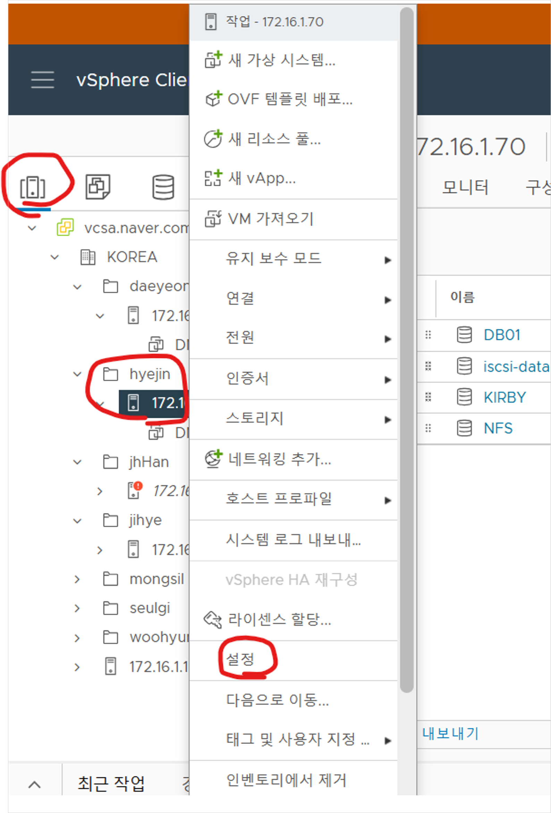

<br>

## 2️⃣ iSCSI Software Adapter 확인

\- ESXi 호스트가 네트워크를 통해 스토리지 장치(iSCSI Target)에 접근하게 해주는 **논리적 인터페이스** <br> \- 구성 탭 → 스토리지 어댑터에 기본적으로 **vmhba65**라는 iSCSI Software Adapter가 자동 생성돼 있음

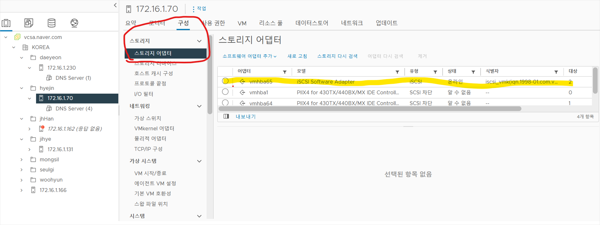

<br>

## 3️⃣ 포트 바인딩 설정

\- iSCSI 트래픽이 어떤 네트워크 인터페이스를 통해 전송될지 명시적으로 지정해야 함 <br> \- 즉 ESXi 호스트가 여러 개의 NIC를 가지고 있을 때, <br> \- 스토리지 접근용 트래픽이 VM 네트워크 등으로 섞이지 않도록 **전용 경로를 고정**함

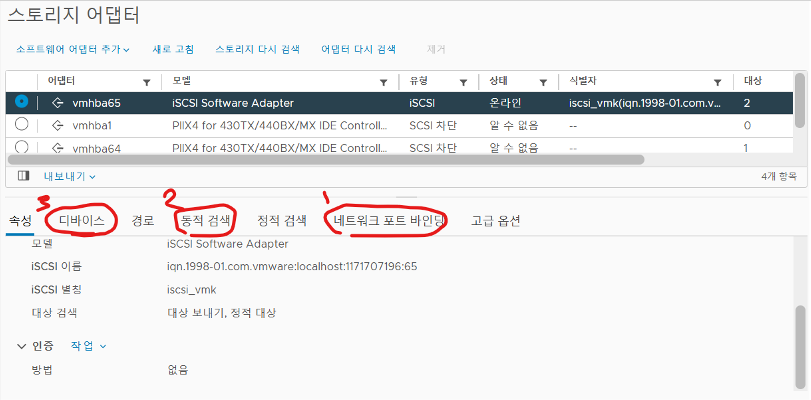

<br>

\- 네트워크 포트 바인딩 탭을 선택하고, **스토리지 전용 VMkernel 포트**를 바인딩함

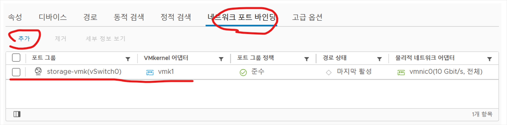

<br>

## 4️⃣ iSCSI Target 등록 (동적 검색)

\- ESXi가 스토리지에 접근하려면, Target(스토리지)의 IP주소와 포트(기본 3260) 정보를 등록해야 함 <br> \- 동적 검색 탭에서 **스토리지 서버의 IP 주소**를 입력하면, ESXi가 해당 서버에 자동으로 연결 요청을 보냄

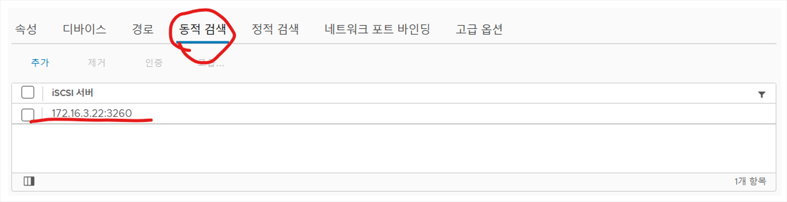

<br>

## 5️⃣ 디바이스 확인

\- 타깃이 정상적으로 등록되면, Device 탭에 연결된 디스크(LUN)가 표시됨 <br> \- 이 LUN은 스토리지에서 서버로 제공되는 논리적 디스크임

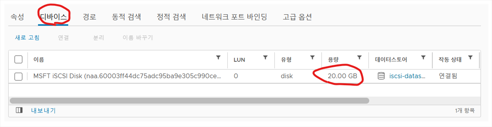

<br>

---

<br>

# ◈ DataStore 생성

iSCSI를 통해 연결된 디스크(LUN)는 VMware에서 바로 사용할 수 있는 형태가 아니다. <br> **이를 VMware 전용 파일 시스템으로 포맷해야만, VM이 스토리지 공간을 실제로 사용할 수 있다.** <br> 이 과정을 통해 생성되는 것이 바로 DataStore다.

DataStore는 VMware가 인식할 수 있는 논리적 스토리지 단위로 <br> VM의 디스크 파일(VMDK), ISO 이미지, 스냅샷 등의 데이터를 저장하는 공간이다.

<br>

### < iSCSI 기반 VMFS DataStore 생성 절차 예시 >

0️⃣ vSphere Client에서 [Storage] → [Datastores] → [New Datastore] 선택함

1️⃣ Create new VMFS datastore를 선택해 새 스토리지를 생성함

2️⃣ DataStore 이름을 지정하고, iSCSI로 연결된 디바이스(LUN)을 선택함

3️⃣ 파일 시스템 형식으로 VMFS 6을 선택하고 포맷을 진행함

4️⃣ 완료 후, Storage 목록에서 새로 생성된 DataStore를 확인할 수 있음

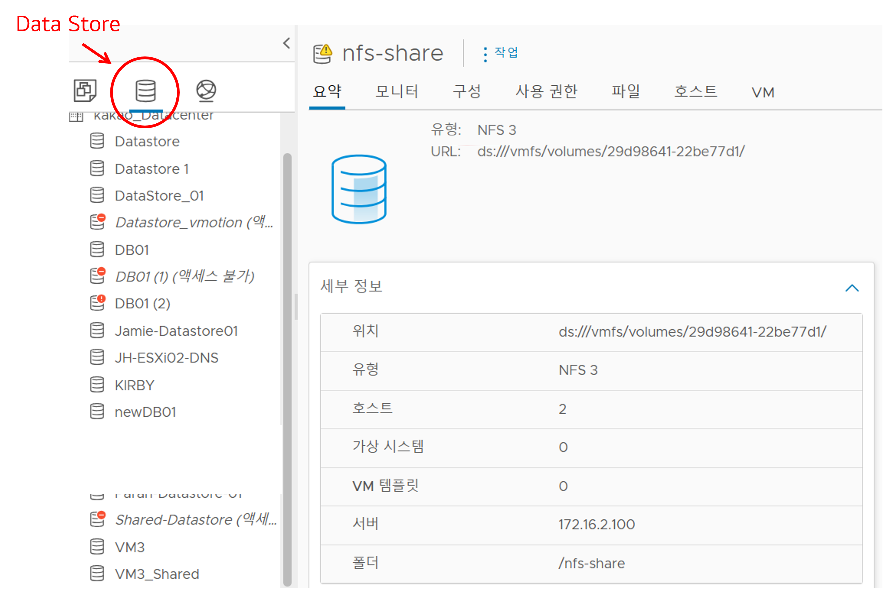


> [!WARNING]
> **Storage는 DataStore가 아니다!** <br> Storage는 단순한 디스크(HDD, SSD)는 포맷되지 않은 물리 공간일 뿐이며 <br> VMware가 이를 사용하려면 DataStore로 변환해야 한다. <br><br> DataStore는 파일 저장소가 아니라, VM 데이터 관리와 접근을 위한 **데이터베이스형 구조**에 가깝다. <br> 여러 호스트가 동시에 접근 가능한 Shared DataStore를 구성하면 <br> VM 간 마이그레이션(vMotion)과 고가용성(HA) 기능을 사용할 수 있다.

<br>

---

<br>

# ◈ vMotion 구성

vMotion은 실행 중인 VM을 중단 없이 다른 호스트로 이동시키는 VMware의 핵심 기능이다. <br> 운영 중인 서비스를 멈추지 않고 CPU, 메모리, 네트워크 상태를 그대로 유지한 채 <br> 실시간 이동이 가능하다는 점에서, 데이터센터의 가용성과 유연성을 높여준다.

그러나 단순히 네트워크만 연결된다고 해서 동작하지 않고, 아래 두 가지 조건이 충족돼야 한다: <br> **✅ 두 ESXi 호스트가 동일한 공유 스토리지(DataStore)에 접근할 수 있어야 함** <br> **✅ vMotion 트래픽을 위한 전용 네트워크(vMotion Network)가 별도로 구성돼야 함**

> [!IMPORTANT]
> vMotion은 메모리 및 CPU 상태를 네트워크로 복제하지만, VM의 가상 디스크(VMDK)는 이동시키지 않는다. <br> 따라서 양쪽 호스트가 같은 DataStore를 바라보고 있어야 파일 손상 없이 VM을 실시간으로 전송할 수 있다. <br><br> 이 과정에서 수백 MB~수 GB에 달하는 메모리 복제 트래픽이 발생하므로, <br> vMotion 트래픽은 일반 VM 네트워크와 물리적으로 분리된 전용 경로를 사용하는 것이 필수적이다. <br> 이를 위해 **각 ESXi 호스트에는 별도의 NIC와 VMkernel 포트를 구성해 vMotion 전용 네트워크를 만든다.**

<br>

### < vMotion 아키텍처 >

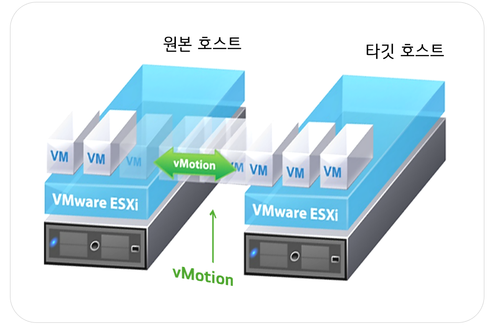

```
1) 원본 호스트의 VM 메모리, CPU 상태를 vMotion Network로 복제

2) 타깃 호스트가 동일한 DataStore를 통해 VM 디스크 파일 접근

3) 모든 상태 동기화 후, VM 실행을 타깃 호스트로 전환
```

<br>

## 1️⃣ ESXi 가상머신에 vMotion용 NIC 추가

\- vMotion 트래픽을 전용화하기 위해 <strong>양쪽 ESXi VM에 Host-only 네트워크(VMnet1)</strong>를 할당함 <br> \- VM이 꺼진(Power Off) 상태에서 NIC를 추가해야 함

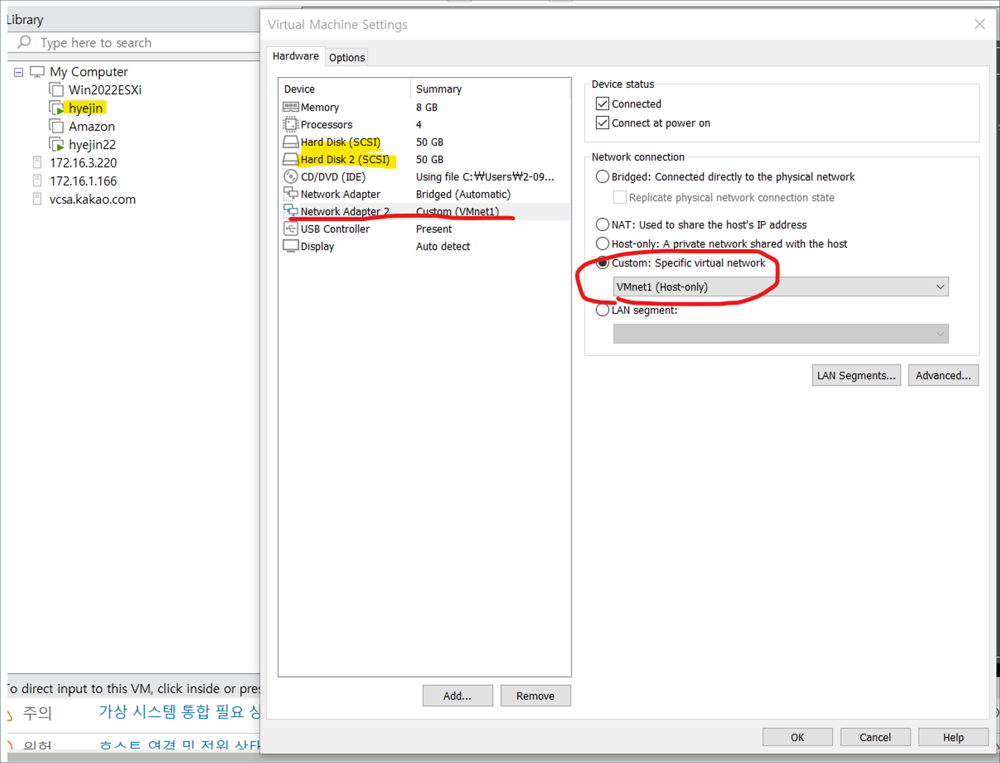

<br>

\- NIC 추가 후, ESXi를 재부팅하면 아래와 같이 새 물리 어댑터가 인식됨

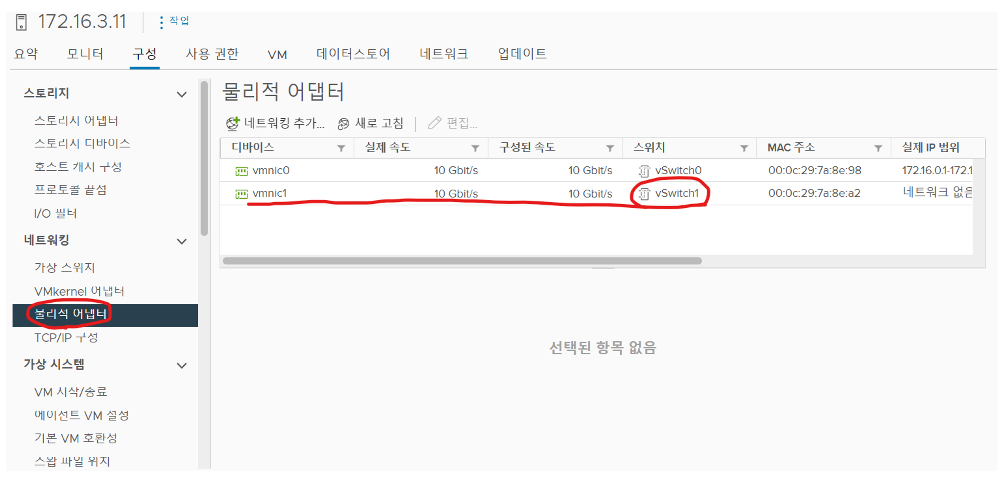

> [!TIP]
> 기본적으로 ESXi VM은 외부망 연결용 Bridged 어댑터 하나만 가지고 시작한다. <br> vMotion 트래픽을 분리하기 위해서는 **두 번째 네트워크 어댑터를 추가**해야 하며, <br> 이때 Custom → VMnet1 (Host-only)로 설정하면 된다.

<br>

## 2️⃣ vSwitch 생성

\- 새로 인식된 물리 어댑터를 **vMotion 전용 가상 스위치**에 연결해야 함 <br> \- 이를 통해 vMotion 트래픽이 기존 Management Network와 분리돼 독립적으로 전송됨

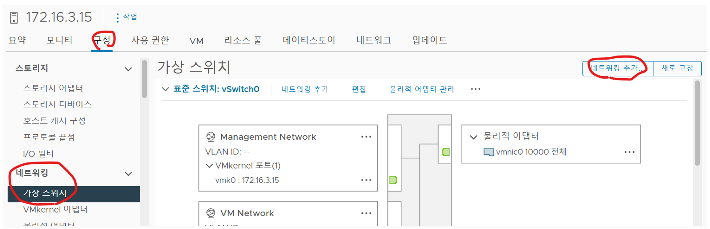

<br>

## 3️⃣ VMkernel 어댑터 생성

\- vSwitch 위에 VMkernel 어댑터를 생성해 vMotion 트래픽이 실제로 흐를 수 있도록 설정함 <br> \- VMkernel은 ESXi 호스트가 IP를 통해 통신하는 인터페이스

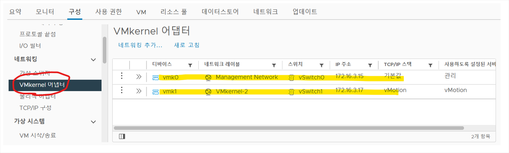

> [!TIP]
> VMkernel( ==vmk1)은 vMotion용 TCP/IP 스택을 사용하며, 다른 호스트의 vmk1과 직접 통신한다. <br> 두 호스트 간 vMotion 트래픽은 <strong>vSwitch1 ↔ vmk1 경로</strong>를 통해 오가며, 이 IP를 통해 메모리 복제가 이루어진다.
<br><br> 일반 VM의 vNIC이 게스트 OS용 네트워크 어댑터라면, <br> **VMkernel 어댑터는 호스트 레벨 트래픽( =IP 포트 역할)을 수행**한다.

<br>

## 4️⃣ vMotion 실행

\- vCenter에서 VM을 **드래그 앤 드롭**하면 자동으로 Migration(마이그레이션) 창이 열림 <br> \- 마이그레이션 유형은 <strong>"계산 리소스 및 스토리지 모두 변경"</strong>을 선택해야 함 (호스트와 DataStore 모두 이동)

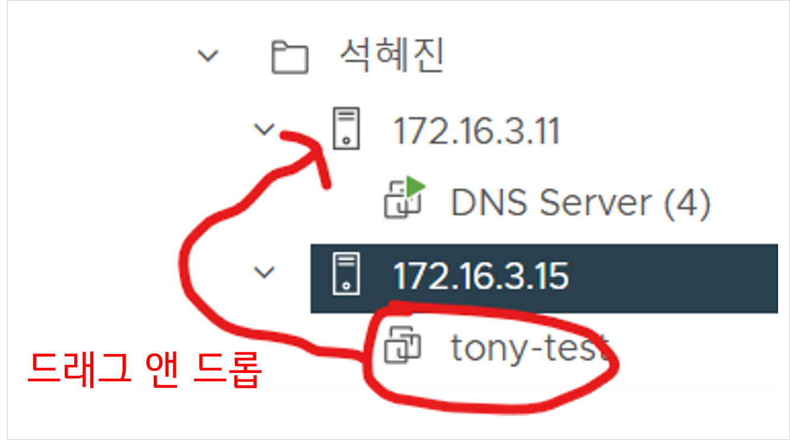

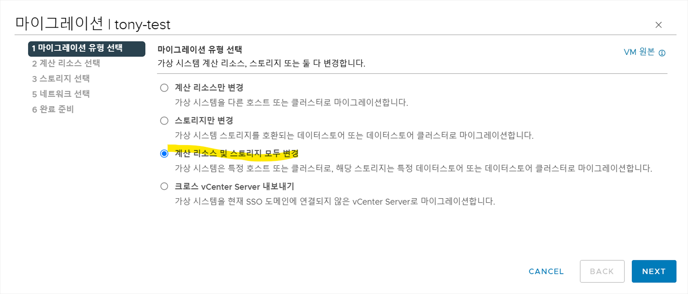

> [!TIP]
> vCenter가 두 호스트 간 공유 스토리지 및 vMotion 네트워크 연결을 이미 검증했다면 <br> 드래그앤드롭만으로 Migration 창이 뜨게 된다. <br> 즉, 사전에 구성된 vSwitch1–vmk1–Shared DataStore 구조가 올바르게 동작하고 있음을 나타낸다.